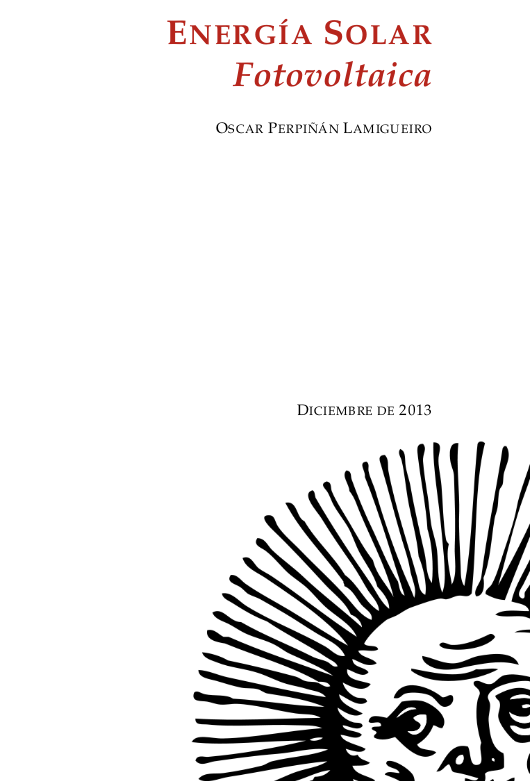

Energía Solar Fotovoltaica
===

Este repositorio contiene los ficheros fuente del libro
"Energía Solar Fotovoltaica" y sus presentaciones asociadas. Este
libro consta de 9 capítulos que cubren los aspectos más importantes de
esta tecnología desde el punto de visto de la ingeniería de sistemas:
geometría y radiación solar, dispositivos, módulos y generadores
fotovoltaicos, las tres principales aplicaciones (sistemas de conexión
a red, autónomos de electrificación rural, y autónomos de bombeo de
agua), seguridad eléctrica en sistemas fotovoltaicos, y tiempo de
recuperación energética. Cuenta con un conjunto de ejercicios
resueltos relacionados con cada capítulo.

 Esta obra está bajo una <a rel="license"
href="http://creativecommons.org/licenses/by-nc-sa/4.0/">Licencia
Creative Commons Atribución-NoComercial-CompartirIgual 4.0
Internacional</a>.

Puedes citar este libro como:

> Perpiñán, O. 2020. Energía Solar Fotovoltaica. http://oscarperpinan.github.io/esf/.

Y si usas bibtex: 

    @book{Perpinan2020,
    author = {Perpi{\~{n}}{\'{a}}n, O.},
    title = {{Energ{\'{i}}a Solar Fotovoltaica}},
    url = {http://oscarperpinan.github.io/esf/},
    year = {2020}
    }

La maduración de este libro se ha realizado en el contexto del Máster
de Energías Renovables y Mercado Energético de la EOI y en los cursos
de experto profesional impartidos por el Departamento de Ingeniería
Eléctrica, Electrónica y de Control de la ETSII-UNED. Una versión
adaptada de este libro fue publicada en 2012 por la editorial Progensa
con el título “Diseño de Sistemas Fotovoltaicos” y con licencia
Creative Commons.
